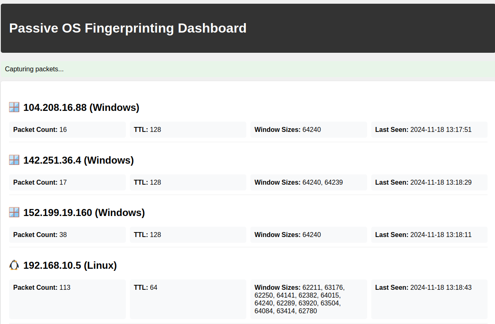

# Passive OS Fingerprinting


Passive OS Fingerprinting tool with a web interface that uses the scapy library to analyze network packets and identify operating systems based on packet signatures.

## Features

- **Passive OS Fingerprinting**: Identifies the operating system of devices on the network based on their network traffic patterns.
- **Real-Time Packet Analysis**: Processes packets in real-time using `scapy`'s sniffing capabilities.
- **Network Monitoring Dashboard**: Provides real-time insights into devices on the network.

## Class Overview

### `PassiveOSFingerprinter`

This class contains the core functionality for capturing and analyzing packets:
- **Packet Capture**: Uses `scapy.sniff` to intercept packets on a specified interface.
- **OS Identification**: Compares captured packet attributes with known OS signatures.
- **Fingerprint Management**: Tracks various attributes of devices, including TTL, window sizes, etc.

## Installation

1. **Clone the repository**:
   ```bash
   git clone https://github.com/your-repo/passive-os-fingerprinting.git
   cd passive-os-fingerprinting
   ```

2. **Install Python dependencies**:
   Ensure Python 3.8+ is installed, then run:
   ```bash
   pip install scapy flask
   ```

---

## Running the Application

1. **Start the Flask App**:
   Execute the following command to start the application:
   ```bash
   python start.py
   ```

2. **Configure Network Interface**:
   The app defaults to a standard interface. To specify a custom interface (e.g., `eth0`), modify the `start_sniffing` method.

3. **Access the Dashboard**:
   Open your web browser and visit:
   ```
   http://127.0.0.1:5000
   ```

4. **View Real-Time Results**:
   Monitor devices and their identified operating systems in real time on the web interface.

---

## Limitations

- **Traffic Dependency**:
  - Devices must generate network traffic to be fingerprinted.
  - Inactive devices or those with minimal traffic cannot be identified.

- **OS Identification Accuracy**:
  - Accuracy relies on predefined OS signatures in the code.
  - To improve results, update the `os_signatures` dictionary with additional or refined signatures. ( Located in pOSf.py )

- **Root/Administrative Privileges**:
  - Sniffing network traffic often requires elevated permissions.

- **Legal Considerations**:
  - Ensure you have proper authorization to monitor the network traffic of devices.
